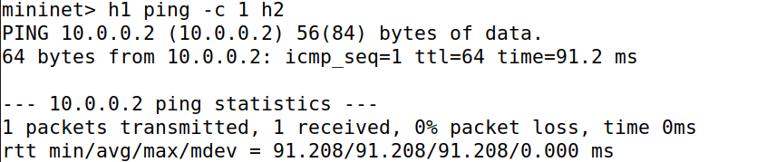
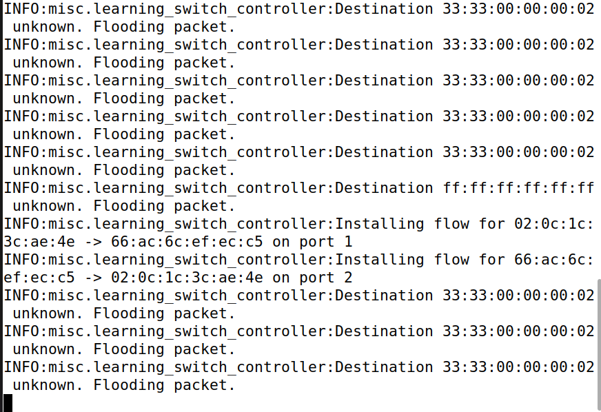
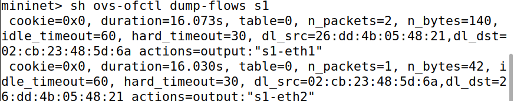
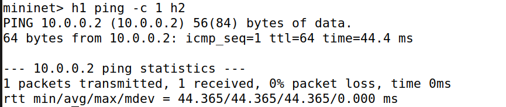
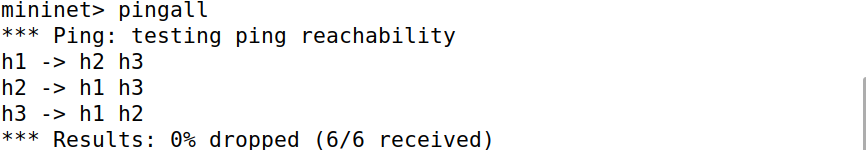

# SDN Learning Switch Controller

A project to implement a Layer 2 learning switch using an SDN controller (POX) and a virtual network (Mininet).

- **Author:** Srivani Karanth
- **SRN:** PES1UG24CS471

---

## 1. Problem Statement & Objective

The goal of this project is to implement an SDN controller that mimics the functionality of a traditional MAC-learning switch. The controller must dynamically learn the location of hosts (MAC-to-port mapping) and install proactive flow rules in the switch to forward traffic efficiently.

The key objectives are:
- **MAC Address Learning:** The controller must inspect incoming packets to learn which host MAC address is on which switch port.
- **Dynamic Flow Rule Installation:** Based on learned information, the controller must program the switch's flow table to forward subsequent packets on the "fast path."
- **Packet Forwarding:** The switch must correctly forward packets to known destinations and flood packets to unknown destinations (including broadcasts).

---

## 2. Project Setup and Execution

### Requirements
- Ubuntu 20.04 or newer
- Mininet
- POX SDN Controller
- Open vSwitch

### Execution Steps
The project requires two terminals to run simultaneously: one for the SDN controller and one for the Mininet network.

**Terminal A: Start the POX Controller**
```bash
# 1. Navigate to the POX directory
cd ~/pox

# 2. Run the custom learning switch controller
./pox.py misc.learning_switch_controller
```

**Terminal B: Start the Mininet Network**
```bash
# 1. Navigate to the project directory
cd ~/sdn-learning-switch-project

# 2. Run the custom topology with a remote controller
sudo mn --custom ./topology.py --topo simple --controller remote,ip=127.0.0.1,port=6633 --switch ovs,protocols=OpenFlow10
```

---

## 3. Proof of Execution & Analysis

The following tests were conducted to verify the functionality of the learning switch.

### Test 1: Initial Ping & MAC Learning

**Action:** A single ping was sent from host `h1` to `h2` to trigger the initial "slow path" where the controller must intervene.
```
mininet> h1 ping -c 1 h2
```

**Result:** The ping was successful, but with a high latency (~91ms). The controller log shows it learned the MAC addresses of the hosts, flooded the initial broadcast (ARP) and multicast (IPv6) packets, and then installed two flow rules for the `h1 <-> h2` conversation.

**Screenshot: Controller Log (Proof of Learning)**



*   **Analysis:** The high latency and the `Installing flow` messages confirm that the packet was sent to the controller (slow path), which then successfully programmed the switch.

### Test 2: Flow Table Verification

**Action:** Immediately after the first ping, the switch's flow table was inspected.
```
mininet> sh ovs-ofctl dump-flows s1
```

**Result:** The flow table contains two new entries corresponding to the conversation between `h1` and `h2`, each with an `idle_timeout` of 60 seconds.

**Screenshot: Switch Flow Table**


*   **Analysis:** This is physical evidence that the POX controller successfully programmed the Open vSwitch, creating a "shortcut" for future packets.

### Test 3: Second Ping & Fast Path Forwarding

**Action:** A second ping was sent from `h1` to `h2` after the flow rules were installed.
```
mininet> h1 ping -c 1 h2
```

**Result:** The ping was successful again, but this time with a much lower latency (~44ms). Critically, **no new logs appeared in the controller terminal**.

**Screenshot: Second Ping Result**


the below image shows that no new logs appeared:


*   **Analysis:** The significantly lower latency and the absence of controller logs prove that the packet was handled directly by the switch using the installed flow rule (fast path), bypassing the controller entirely. This demonstrates the efficiency gain of SDN.

### Test 4: Full Network Connectivity

**Action:** The `pingall` command was used to verify that all hosts in the topology could communicate with each other.
```
mininet> pingall
```

**Result:** The test showed 0% packet loss, confirming that the controller could learn and establish paths for all hosts in the network.

**Screenshot: Pingall Result**


### Test 5: Performance Measurement

**Action:** The `iperf` tool was used to measure the maximum achievable bandwidth between `h1` and `h2`.
```
mininet> iperf h1 h2
```

**Result:** A high throughput of ~41 Gbits/sec was observed.

**Screenshot: Iperf Result**


*   **Analysis:** The test confirms that high-performance traffic can be sent over the SDN-controlled links. The high value is characteristic of Mininet's in-kernel packet forwarding, which is much faster than physical hardware.

---

## 4. Source Code

The project consists of two main Python files:

1.  **`learning_switch_controller.py`**: This file contains the logic for the POX controller. It listens for `PacketIn` events from the switch, implements the MAC learning algorithm, and sends `FlowMod` messages to install forwarding rules.

2.  **`topology.py`**: This file defines the custom network topology for Mininet. It creates a simple network of 3 hosts and 1 switch, designed to be launched with the `mn` command.

---

## 5. References

- Mininet Documentation: [http://mininet.org/](http://mininet.org/)
- POX Controller Wiki: [https://noxrepo.github.io/pox-doc/html/](https://noxrepo.github.io/pox-doc/html/)
- Open vSwitch Documentation: [https://docs.openvswitch.org/](https://docs.openvswitch.org/)
